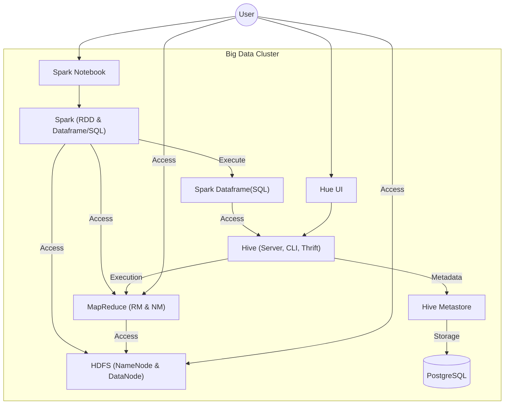

# Docker Big Data Cluster for Learner

A comprehensive, containerized Big Data environment for learning and development. This cluster includes Apache Hadoop, Hive, Spark, and Hue, all pre-configured to work together.


## 🏗 Architecture Overview

The cluster consists of the following components:

- **Hadoop 3.3.6**: NameNode, DataNode, ResourceManager, NodeManager, HistoryServer.
- **Hive 3.1.3**: HiveServer2, Hive Metastore.
- **Spark 3.5.5**: Spark Notebook (Jupyter) with PySpark and Delta Lake support.
- **Database**: PostgreSQL for Hive Metastore.
- **UI Tools**: Hue (Query Editor), Portainer (Container Management).



### 🔄 Data & Execution Flows

The following flows illustrate how data is processed in the cluster:

1.  **Spark Direct Processing**:
    `HDFS (NameNode, DataNode) ← Spark (RDD, SQL)`
    *Spark interacts directly with HDFS for high-performance data processing.*

2.  **Hybrid Processing**:
    `HDFS (NameNode, DataNode) ← MapReduce (NM, RM) & ← Spark (RDD, SQL)`
    *Both engine types can coexist and process data stored in HDFS.*

3.  **Hive over MapReduce**:
    `HDFS (NameNode, DataNode) ← MapReduce (NM, RM) ← Hive (CLI, Thrift)`
    *Standard Hive queries are translated into MapReduce jobs to process data in HDFS.*

4.  **Spark over Hive**:
    `HDFS (NameNode, DataNode) ← MapReduce (NM, RM) ← Hive (CLI, Thrift) ← Spark (SQL)`
    *Spark SQL can leverage the Hive infrastructure for metadata and execution.*

5.  **Hive Driver Operations**:
    `Hive Metastore, HDFS ← Hive Driver ← Hive (CLI, Thrift)`
    *The Hive Driver coordinates metadata from the Metastore and data from HDFS.*

## 🚀 Quick Start

### Prerequisites
- Docker and Docker Compose
- `make` utility

### Running the Cluster

1. **Start the cluster**:
   ```bash
   make start
   ```

2. **Wait for services to initialize**:
   It may take a minute for the Hive Metastore and NameNode to be fully ready.

3. **Stop the cluster**:
   ```bash
   make stop
   ```

4. **Clean up (remove volumes)**:
   ```bash
   make cleanup
   ```

## 🌐 Service Access

| Service | Port | URL |
| :--- | :--- | :--- |
| **Hue (Query Editor)** | 8889 | [http://localhost:8889](http://localhost:8889) |
| **Spark Notebook (Jupyter)** | 8888 | [http://localhost:8888](http://localhost:8888) |
| **Hadoop NameNode** | 9870 | [http://localhost:9870](http://localhost:9870) |
| **YARN ResourceManager** | 8088 | [http://localhost:8088](http://localhost:8088) |
| **Portainer** | 3000 | [http://localhost:3000](http://localhost:3000) |
| **MapReduce History Server**| 8188 | [http://localhost:8188](http://localhost:8188) |
| **Spark Application UI** | 4040 | [http://localhost:4040](http://localhost:4040) |

## 🛠 Configuration

Environment variables for the cluster are managed in `hadoop-hive.env`. You can modify this file to change Hadoop or Hive configurations.

## 💻 Multi-Platform Support

This project supports both **x86_64 (AMD64)** and **ARM64 (Apple Silicon M1/M2/M3)**.

- For **Intel/AMD**: `make start`
- For **Apple Silicon (ARM)**: `make start` (The images are multi-arch compatible)

> [!NOTE]
> If you need to rebuild images locally for your specific architecture, you can use the `buildx` commands in the `Makefile`.

## 📚 Credits
This project is based on and inspired by:
- [big-data-europe/docker-hadoop](https://github.com/big-data-europe/docker-hadoop)
- [big-data-europe/docker-hive](https://github.com/big-data-europe/docker-hive)